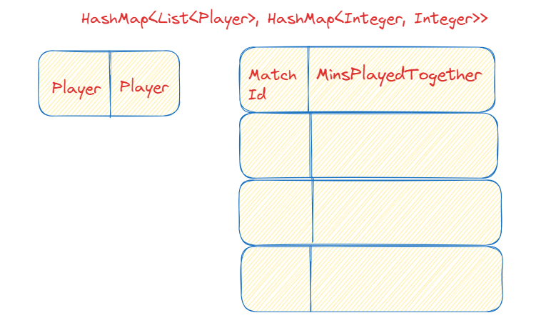

To find the pair of footballers who played the longest time together, I :

1) Sorted the Records by match id and put them in a HashMap where the key is match id and the value is a List of Records that contain that match id.
   I did it to make sure different matches are separated and isolated, so I only check records within one match.
2) I iterate all the Records in the List of every entry of the HashMap. I do that to compare player's start minutes (when they entered the field)
   and finish minutes (when they left the field).
3) I have written a method that makes sure I don't try to calculate minutes played together of two players who never played simultaneously in the first place.
   I do that because there are cases where a pair of players never played together, but their start and finish minutes satisfy the conditions of the formulas of calculating minutes
   that I Implemented in the next step.
4) We know that two players never played together if one of them left before the other one entered. So, I put it this way:
   Two players did NOT play together if:
   -player A left before player B entered ( A finishMin < B startMin )
   OR
   -player B finished before player A entered ( B finishMin > A startMin )
5) Now that I skip the pairs who didn't play together and don't have to worry about them satisfy the conditions of the formulas below, I can calculate the minutes
   of the pairs who played together.
   There are several cases:

- Players A and B enter the field at the same time. Calculate: Minutes of the player who left first - the minutes they started;

- Player A enters the field. Player B enters the field. Player A leaves the field. Player B leaves. Calculate: Player A finish minutes - Player B start minutes;

- Player B enters the field. Player A enters. Player B leaves. Player A leaves. Calculate: Player B finish minutes - Player A start minutes;

- Player A enters. Player B enters. Player B leaves. Player A leaves. (Player B plays within the time Player A plays). Calculate: Player B finish time - Player A start time;

- Player B enters. Player A enters. Player A leaves. Player B leaves. (Player A plays within the time Player B plays). Calculate: Player A finish time - Player A start time;

